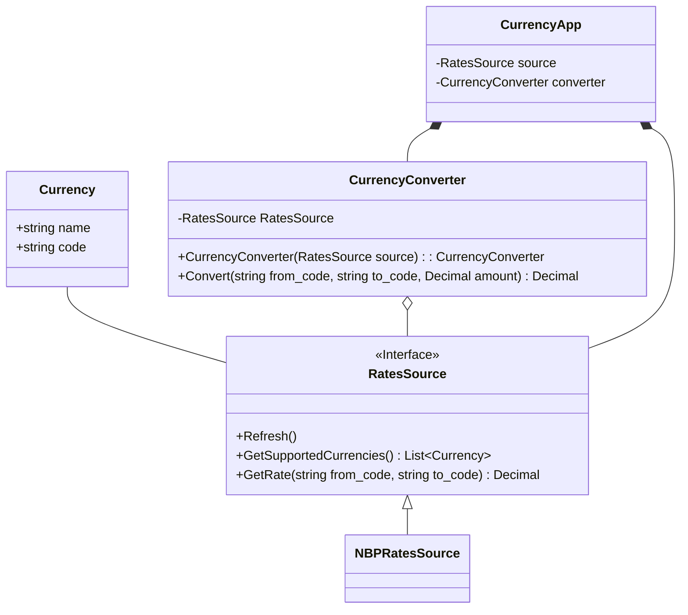

```mermaid
classDiagram

    Currency -- RatesSource
    class RatesSource {
        <<Interface>>
        +Refresh()
        +GetSupportedCurrencies() List~Currency~
        +GetRate(string from_code, string to_code) Decimal
    }
    RatesSource <|-- NBPRatesSource 
    class NBPRatesSource{
    }

    class Currency{
      +string name
      +string code
    }

    CurrencyConverter o-- RatesSource
    class CurrencyConverter{
        -RatesSource RatesSource
        +CurrencyConverter(RatesSource source): CurrencyConverter
        +Convert(string from_code, string to_code, Decimal amount) Decimal
    }

    CurrencyApp *-- CurrencyConverter
    CurrencyApp *-- RatesSource
    class CurrencyApp {
        -RatesSource source
        -CurrencyConverter converter
    }
```
