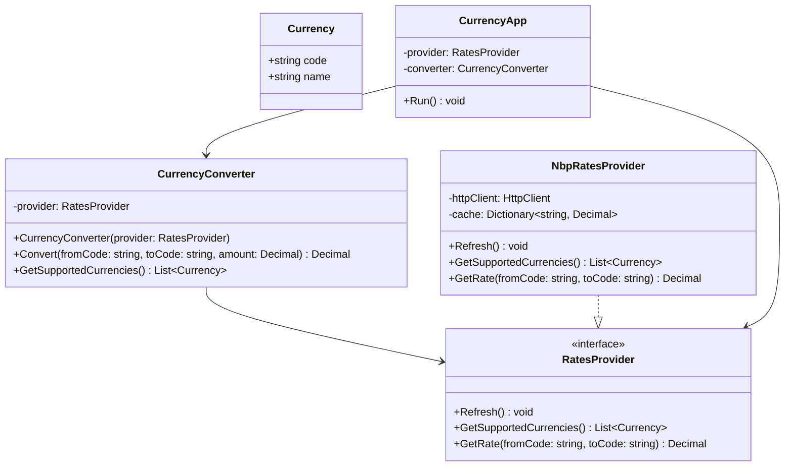

```mermaid
classDiagram
    class Currency {
        +string code
        +string name
    }

    class RatesProvider {
        <<interface>>
        +Refresh() void
        +GetSupportedCurrencies() List~Currency~
        +GetRate(fromCode: string, toCode: string) Decimal
    }

    class NbpRatesProvider {
        -httpClient: HttpClient
        -cache: Dictionary~string, Decimal~
        +Refresh() void
        +GetSupportedCurrencies() List~Currency~
        +GetRate(fromCode: string, toCode: string) Decimal
    }

    class CurrencyConverter {
        -provider: RatesProvider
        +CurrencyConverter(provider: RatesProvider)
        +Convert(fromCode: string, toCode: string, amount: Decimal) Decimal
        +GetSupportedCurrencies() List~Currency~
    }

    class CurrencyApp {
        -provider: RatesProvider
        -converter: CurrencyConverter
        +Run() void
    }

    CurrencyConverter --> RatesProvider
    NbpRatesProvider ..|> RatesProvider

    CurrencyApp --> CurrencyConverter
    CurrencyApp --> RatesProvider
```
