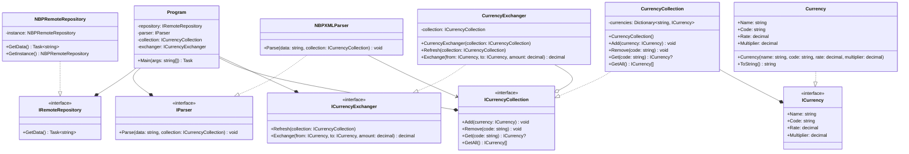

```mermaid
classDiagram
    class Program {
        -repository: IRemoteRepository
        -parser: IParser
        -collection: ICurrencyCollection
        -exchanger: ICurrencyExchanger
        +Main(args: string[]) Task
    }

    class IRemoteRepository {
        <<interface>>
        +GetData() Task~string~
    }

    class NBPRemoteRepository {
        -instance: NBPRemoteRepository
        +GetData() Task~string~
        +GetInstance() NBPRemoteRepository
    }

    class IParser {
        <<interface>>
        +Parse(data: string, collection: ICurrencyCollection) void
    }

    class NBPXMLParser {
        +Parse(data: string, collection: ICurrencyCollection) void
    }

    class ICurrency {
        <<interface>>
        +Name: string
        +Code: string
        +Rate: decimal
        +Multiplier: decimal
    }

    class ICurrencyExchanger {
        <<interface>>
        +Refresh(collection: ICurrencyCollection)
        +Exchange(from: ICurrency, to: ICurrency, amount: decimal) decimal
    }


    class CurrencyExchanger {
        -collection: ICurrencyCollection
        +CurrencyExchanger(collection: ICurrencyCollection)
        +Refresh(collection: ICurrencyCollection)
        +Exchange(from: ICurrency, to: ICurrency, amount: decimal) decimal
    }

    class Currency {
        +Name: string
        +Code: string
        +Rate: decimal
        +Multiplier: decimal
        +Currency(name: string, code: string, rate: decimal, multiplier: decimal)
        +ToString() string
    }


    class ICurrencyCollection {
        <<interface>>
        +Add(currency: ICurrency) void
        +Remove(code: string) void
        +Get(code: string) ICurrency?
        +GetAll() ICurrency[]
    }

    class CurrencyCollection {
        -currencies: Dictionary~string, ICurrency~
        +CurrencyCollection()
        +Add(currency: ICurrency) void
        +Remove(code: string) void
        +Get(code: string) ICurrency?
        +GetAll() ICurrency[]
    }

    Program --* IRemoteRepository
    Program --* IParser
    Program --* ICurrencyCollection
    Program --* ICurrencyExchanger

    NBPRemoteRepository ..|> IRemoteRepository
    NBPXMLParser ..|> IParser
    Currency ..|> ICurrency
    CurrencyExchanger ..|> ICurrencyExchanger
    CurrencyCollection ..|> ICurrencyCollection

    CurrencyCollection --* ICurrency
    CurrencyExchanger --o ICurrencyCollection
    NBPXMLParser --> ICurrencyCollection

```
